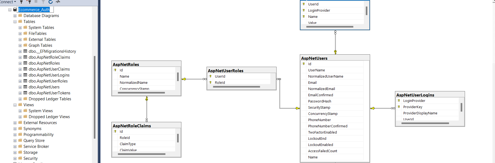
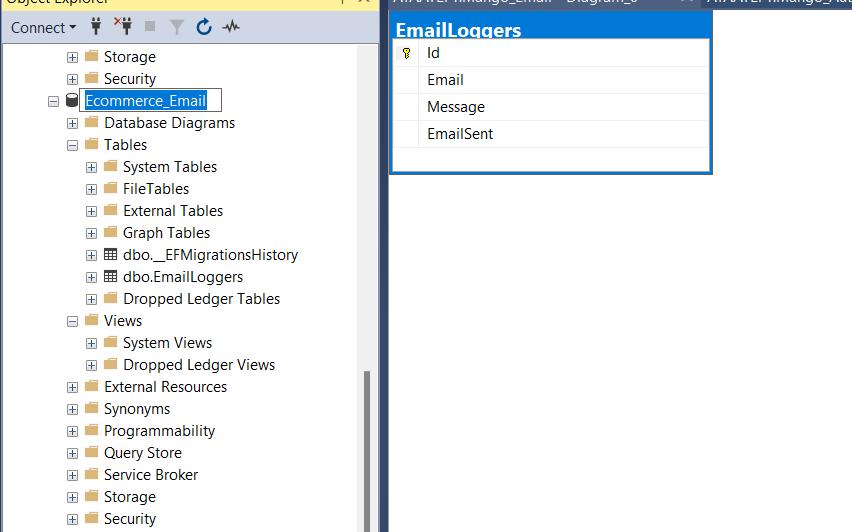
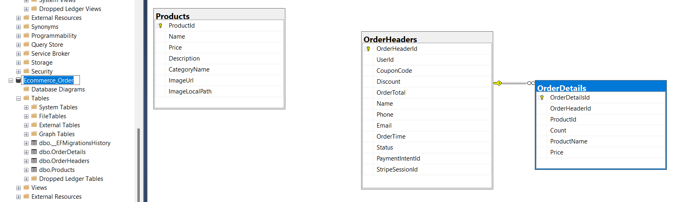
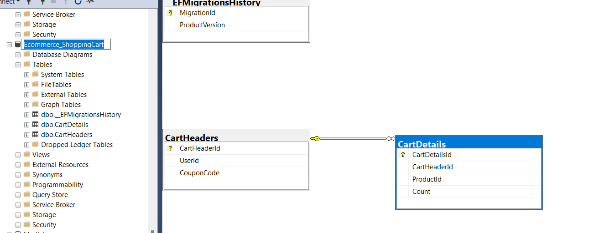
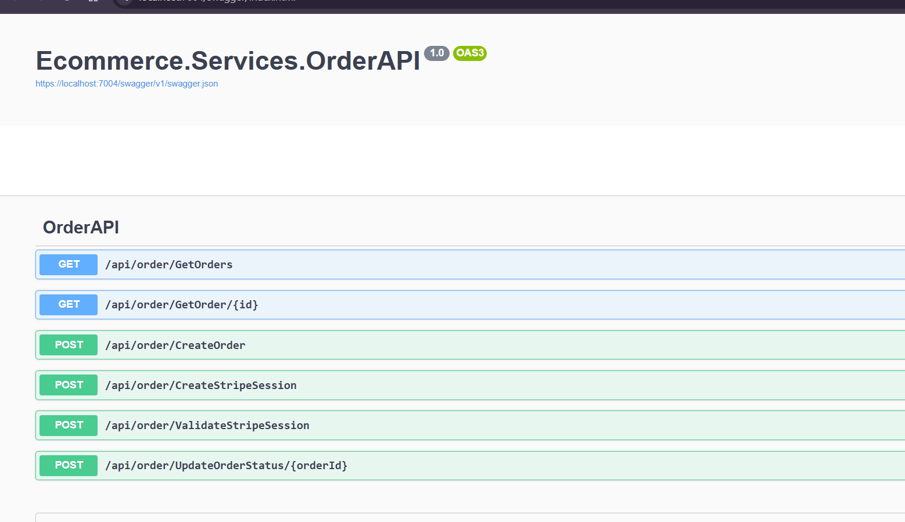
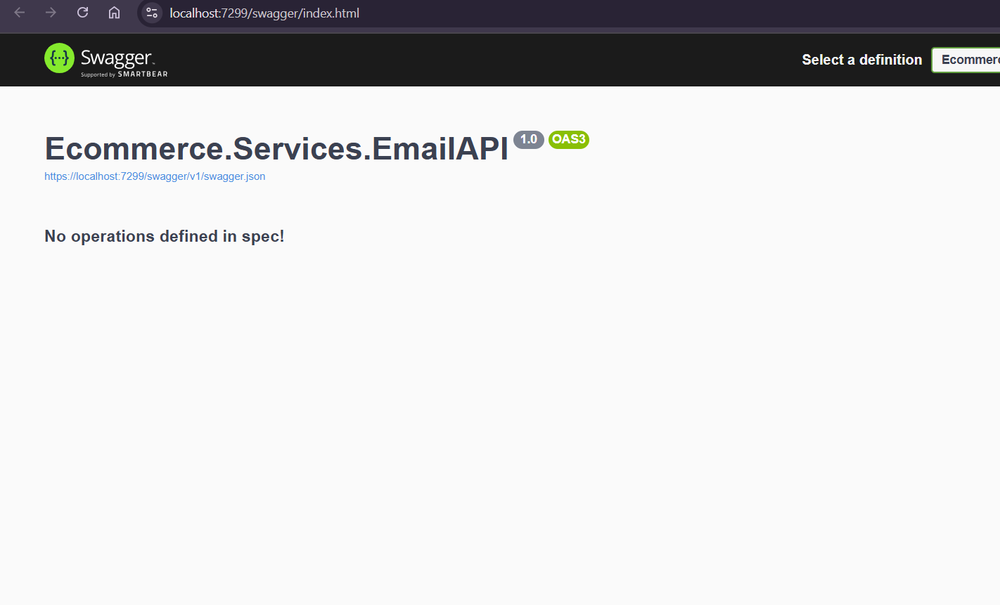
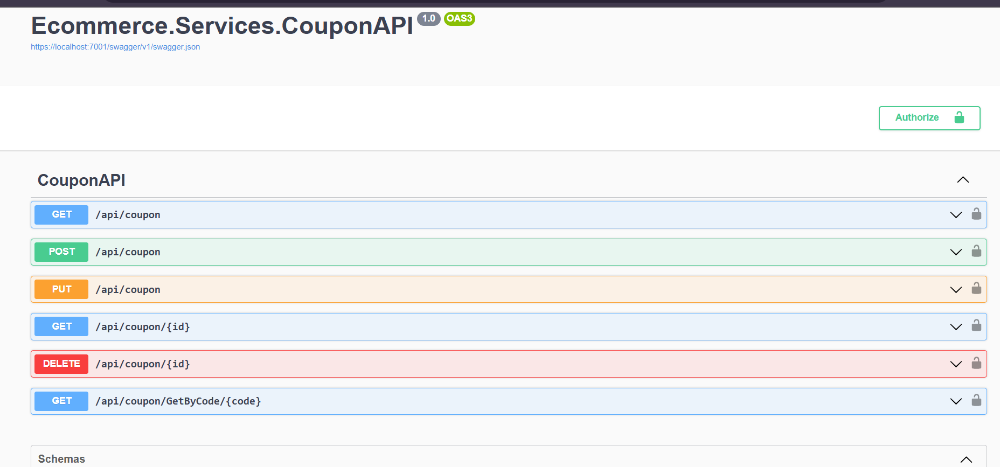
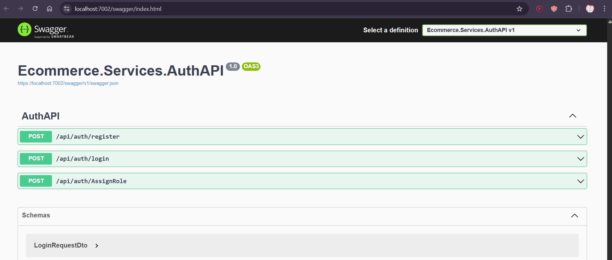
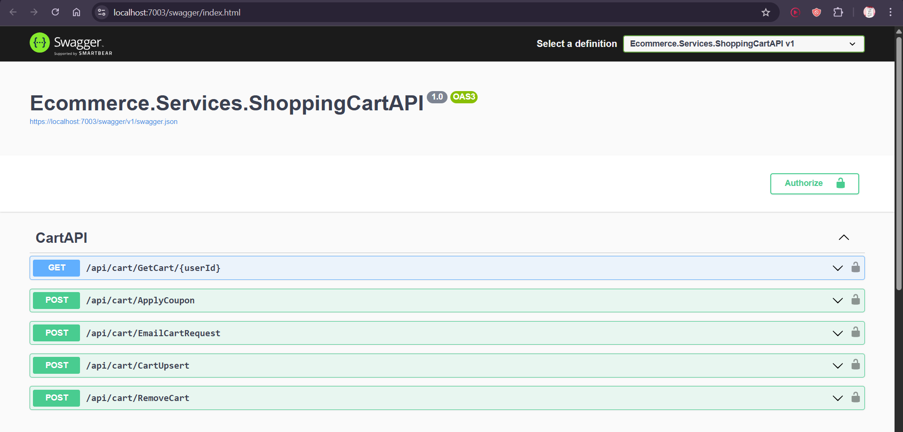
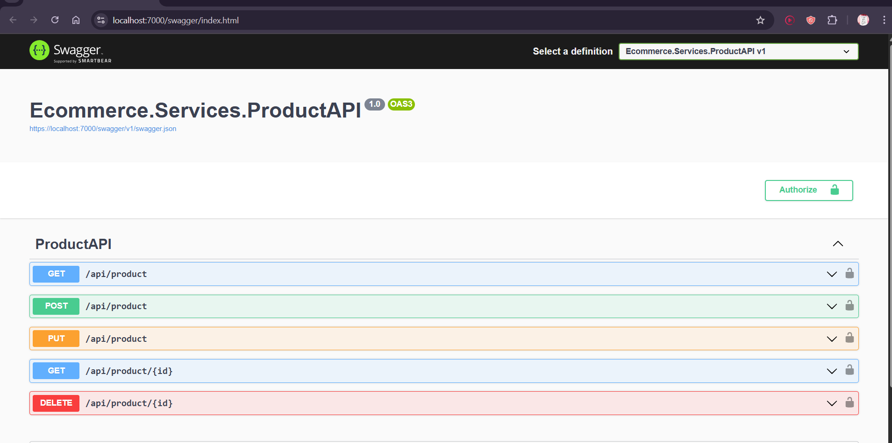

<div align="center">
  <h1>Modern E-Commerce Platform</h1>
  <p>A cloud-ready, modular, microservices-based e-commerce system built with ASP.NET Core, leveraging clean architecture, secure payment integration, and scalable communication.</p>
  
  
  
  
  
  
  
  
  
  
</div>

---

## Table of Contents

- [Overview](#overview)
- [Features](#features)
- [Architecture](#architecture)
- [Database Design](#database-design)
- [API Endpoints](#api-endpoints)
- [Getting Started](#getting-started)

---

## Overview

This e-commerce platform is designed using a **Microservices Architecture**, allowing services to operate independently and scale efficiently. The system supports secure transactions via **Stripe**, uses **Azure Service Bus** for asynchronous messaging, and includes an **API Gateway** to route requests and manage authentication with **JWT tokens**.

---

## Features

- Modular and independent microservices
- Each microservice has its **own database**
- Secure **payment processing** with Stripe
- Real-time communication via **Azure Service Bus**
- Authentication and authorization via **JWT**
- Unified access point through an **API Gateway**
- Admin and customer interaction through **ASP.NET MVC frontend**
- Clean architecture with CQRS and MediatR
- Swagger UI for testing and documentation

---

## Architecture

- **Backend:** Multiple .NET Web APIs acting as microservices  
- **Frontend:** ASP.NET MVC application consuming APIs  
- **Communication:** JSON-based HTTP calls & Azure Service Bus  
- **Security:** JWT Token + API Gateway  
- **Database:** Each microservice owns its separate SQL Server database  
- **Payments:** Stripe integration for checkout  

---

## Database Design

Each microservice has its own isolated database schema.






---

## API Endpoints

Each service exposes a clear set of RESTful endpoints. Documentation is available via Swagger.








---

## Getting Started

### Prerequisites

- [.NET SDK](https://dotnet.microsoft.com/en-us/download)
- [SQL Server](https://www.microsoft.com/en-us/sql-server/sql-server-downloads)
- [Azure Account (or Azurite for local testing)](https://azure.microsoft.com/)
- [Stripe Account (for test keys)](https://stripe.com/docs/testing)

### Setup

1. Clone the repository

   ```bash
   git clone https://github.com/ayaatef11/Ecommerce-Microservices.git
   cd Ecommerce-Microservices
